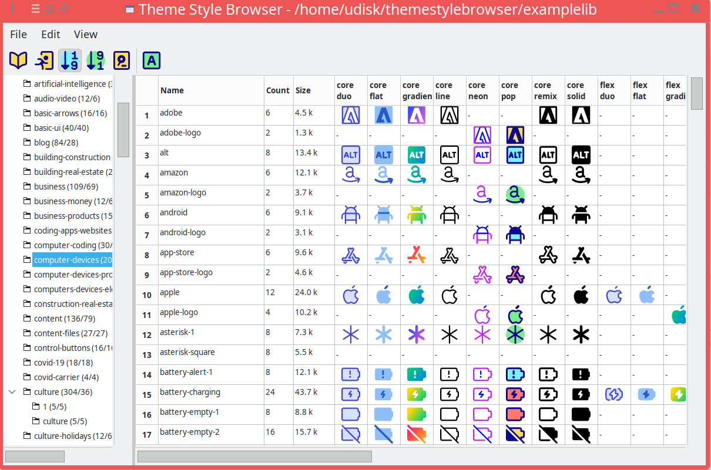
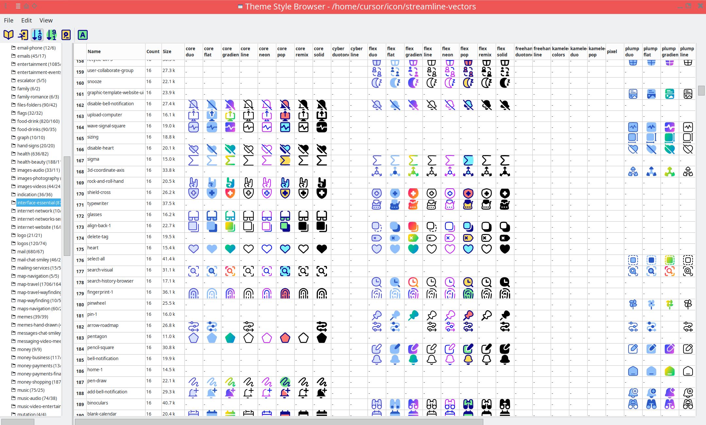
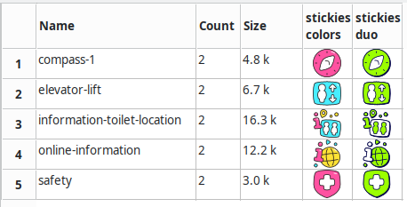
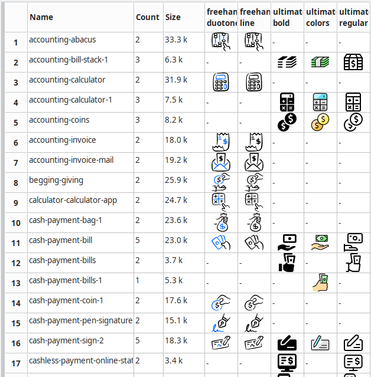
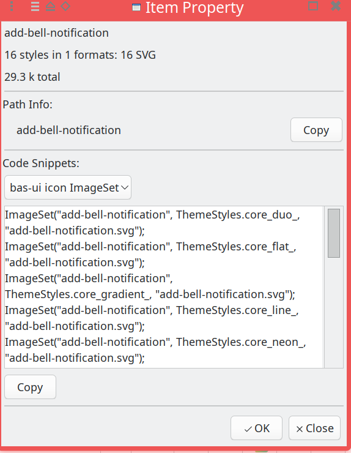
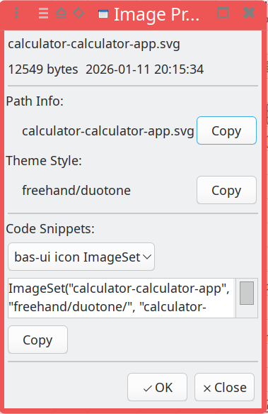

# Theme Style Browser (tsb)

Graphical browser for icon libraries organized by **theme/style** and **package**.

## Layout

Libraries are expected to look like:

```
<library-root>/
├── .themestyles          # list of theme/style dirs (e.g. flex/regular, pixel)
├── flex/
│   ├── regular/
│   │   ├── computer/     # package dir
│   │   │   ├── mouse.png
│   │   │   └── keyboard.png
│   │   └── travel/
│   └── line/
├── freehand/
│   ├── color/
│   └── regular/
└── pixel/
```

`.themestyles` format (comments and blank lines ignored):

```
# example
flex/regular
flex/line
freehand/color
pixel
```

## Usage

- **Run:** `themestylebrowser [OPTIONS] [<librarydir>]`
- **File → Open library:** choose the library root (directory containing `.themestyles`).
- **Left:** package tree (expand/collapse). Node label: `name (filecount/itemcount)`.
- **Right:** file list — Name, Count, Size, and one column per themestyle (thumbnail or `-`).
- **View menu:** Sort by Name (default), Sort by Count, Sort by Size.
- **Column header:** left-click Name/Count/Size to sort; right-click Name for themestyle column visibility.
- **Double-click** filename → Item property; double-click icon cell → Image property (path/code snippets, Copy).

## Screenshots

| Main window | Maximized |
|-------------|-----------|
|  |  |

| Icon grid | Item / Image properties |
|-----------|-------------------------|
|   |   |

## Build

- **Dependencies:** meson, ninja, pkg-config, libbas-c, libbas-cpp, libbas-ui, wxWidgets (GTK3).
- **Build:**
  ```bash
  meson setup build && meson compile -C build
  ```
- **Run:** `./build/themestylebrowser` or after install: `themestylebrowser`.

## Debian

```bash
dpkg-buildpackage -us -uc -b
```

## Author

Lenik

## License

AGPL-3.0-or-later, with the following additional restriction (Anti-AI statement):

**Use of this software or its source code for training, fine-tuning, or evaluating machine learning or artificial intelligence systems is prohibited.**
